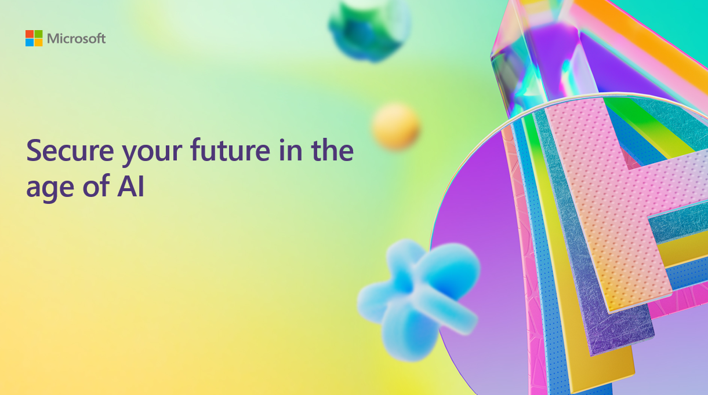

# Secure your future in the age of AI

## Session Description

Discover why security should be your top priority in your AI transformation. Gain insight on how the threat landscape is evolving, how AI can assist IT and security teams with cyber defense, and how IT and security teams can accelerate the safe adoption of AI. 

## Session Resources
You can find slides of the presentation here.

| Resources          | Links                             | Description        |
|:-------------------|:----------------------------------|:-------------------|
| BRK320 English-langugae PPT Slides | [Link](https://www.google.com/) | Presentation deck in English |

## Content Owners
Jessica Afeku, Director of CISO Community, Microsoft

